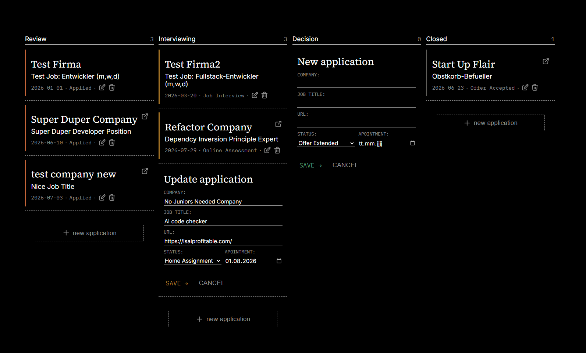

# Job Application Tracker

A full-stack web app for tracking job applications on a Kanban-style board, built as a **learning project** to practice backend and frontend development close to industry best practices.

**Dependency Inversion Principle**: Low-Level DB classes can be added (e.g. postgres) via DI and depend on high-level interface contracts.



> 🚧 **Work in progress.** The backend is complete and tested. The frontend (Kanban board) is actively being built out. See [Roadmap](#roadmap) below for what's next.

---

## Why this project exists

This isn't just an app to use, it's an app to learn from. Every architectural decision (repository pattern, Pydantic model layering, callback-based UI components, etc.) was made deliberately, with the reasoning behind it tracked in an internal project log. The goal is to come out the other side with a real, transferable understanding of full-stack fundamentals, not just a working tracker.

---

## Tech Stack

**Backend**

- Python 3 / [FastAPI](https://fastapi.tiangolo.com/)
- SQLite (via `sqlite3`)
- [Pydantic v2](https://docs.pydantic.dev/latest/) for request/response validation

**Frontend**

- Vanilla JavaScript (ES Modules) — no framework, by design
- Plain HTML & CSS (flexbox-based layout)

**Tooling**

- VS Code, Python virtual environment
- Swagger UI for manual API testing

---

## Architecture

### Database

A relational, 3-table SQLite schema (Database layer can be replaced via adding low-level db connection classes and through dependency injection in higher level classes (Dependency Inversion Principle)):

```
phase  →  status  →  application
```

- `UNIQUE` constraints prevent duplicate phases/statuses
- Seed data is inserted idempotently (`INSERT OR IGNORE`)

### Backend — 🚧 In Progress

```
backend/
├── database/
├── models/
└── repositories/
│    ├── interfaces/ → high level contracts that db layers need to fullfill
│    ├── sqlite/     → sqlite db repositories implementing all behavior of the interface contract
│    ├── dependencies/      → injects the DB connection layer and the DB repository class -> only place that needs to change if new DB repository/connection layer is added
└── routes/
```

- One `APIRouter` per resource (applications, statuses, phases), registered in `main.py`
- Pydantic v2 models split into **Read / Write / Update** variants, organized in a `models/` package
- Shared field validators (e.g. "must not be empty", "must be positive") centralized in `models/helper.py`
- Repository pattern: raw SQLite rows are mapped to validated Pydantic models via `model_validate()`
- Database access via `dependencies.py`, which accepts a DB connection and a concrete DB class. All DB classes need to fullfill the interface contract specified in `interfaces/{interface_class}`
- `PATCH` endpoints follow a **fetch → merge → save** pattern using `model_dump(exclude_unset=True)`, so partial updates only touch the fields actually sent
- All routes are synchronous (`def`, not `async def`) — a deliberate choice given SQLite's threading model
- The frontend is served directly by FastAPI via `StaticFiles`

Full CRUD is implemented and manually tested via Swagger UI for applications, statuses, and phases.

### Frontend — 🚧 In Progress

```
frontend/
├── index.html
├── css/
│   └── style.css
└── js/
    ├── config.js   → API base URL config
    ├── api.js      → fetch calls to the backend
    ├── ui.js       → DOM rendering helpers
    └── app.js       → orchestration, event wiring, state
```

**Working features:**

- Swappable database conenction layer (switch from SQLite to PostgreSQL planned)
- Kanban board: phases rendered as columns, applications as cards
- Create, view, and delete applications through the UI
- Inline card editing (an update form swaps in over the card in place)
- A shared form component serves both the "create" and "edit" flows, driven by mode-aware callbacks
- Reference data (phases & statuses) is fetched once and cached, instead of being re-fetched on every render
- Applications are sorted by application date at the database layer (nulls last)
- Drag-and-drop status updates: cards can be dragged between (and within) columns using the native HTML5 Drag and Drop API — no external library. Dropping into a new phase prompts for the target status, then persists the change. Cards also visually reorder in real time as they're dragged, rather than only snapping into place on drop.

---

## Project Structure

```
backend/
├── main.py
├── database/
├── models/
├── routes/
└── repositories/

frontend/
├── index.html
├── css/
└── js/
```

---

## Running locally

> These are general setup steps — adjust paths/commands to your environment.

```bash
# Backend
cd backend
python -m venv venv
venv\Scripts\activate        # Windows
pip install -r requirements.txt
uvicorn main:app --reload
```

The frontend is served by FastAPI itself (via `StaticFiles`), so once the backend is running, the app is available at the configured local URL — no separate frontend server needed.

API docs (Swagger UI) are available at `/docs` once the server is running.

---

## Roadmap

**Up next:**

- DB table that logs the application history (to render visualizations, e.g. a river diagram)

**Deferred for later:**

- JWT authentication (admin-only CRUD for statuses/phases)
- Pagination
- Automatically extract relevant information from the application descriptions by using their URL to extract relevant data from their page.

---

## License

MIT
