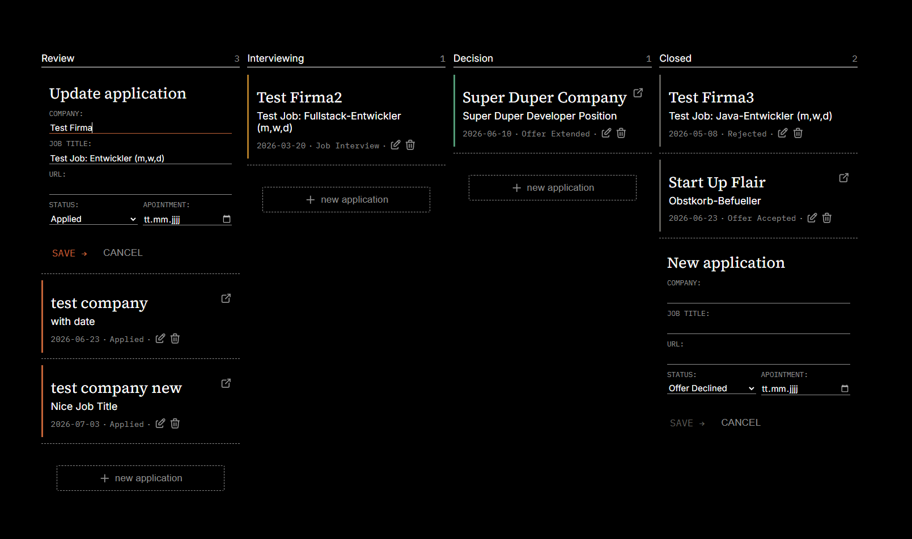

# Job Application Tracker

A full-stack web app for tracking job applications on a Kanban-style board, built as a **learning project** to practice backend and frontend development close to industry best practices.

**Dependency Inversion Principle**: the backend uses an Abstract Factory (`RepositoryFactory`) so new low-level DB classes (e.g. PostgreSQL) can be added purely through dependency injection, depending only on high-level interface contracts.



> 🚧 **Work in progress.** Core CRUD (applications, statuses, phases) is complete and tested. The application history log — the foundation for a Sankey diagram of each application's journey — is partway in: schema and create-path are done, status-change logging and the visualization itself are not. See [Roadmap](#roadmap) below for what's next.

---

## Why this project exists

This isn't just an app to use, it's an app to learn from. Every architectural decision (repository pattern, Pydantic model layering, callback-based UI components, etc.) was made deliberately, with the reasoning behind it tracked in an internal project log. The goal is to come out the other side with a real, transferable understanding of full-stack fundamentals, not just a working tracker.

---

## Tech Stack

**Backend**

- Python 3 / [FastAPI](https://fastapi.tiangolo.com/)
- SQLite (via `sqlite3`)
- [Pydantic v2](https://docs.pydantic.dev/latest/) for request/response validation

**Frontend**

- Vanilla JavaScript (ES Modules) — no framework, by design
- Plain HTML & CSS (flexbox-based layout)

**Tooling**

- VS Code, Python virtual environment
- Swagger UI for manual API testing

---

## Architecture

### Database

A relational, 4-table SQLite schema. The database layer sits behind an **abstract factory** (see the Backend section below), so a new backend can be added without touching routes or models:

```
phase  →  status  →  application
```

- `UNIQUE` constraints prevent duplicate phases/statuses
- Seed data is inserted idempotently (`INSERT OR IGNORE`)
- `application_history_log` is an append-only event log referencing all three tables above — one row per phase/status an application has ever been in, used to reconstruct each application's journey (and, aggregated across applications, to drive the Sankey diagram planned in the Roadmap)
- A **composite foreign key** enforces that a logged status actually belongs to the logged phase: `status` carries `UNIQUE(id, phase_id)`, and `application_history_log` references it via `FOREIGN KEY (phase_id, status_id) REFERENCES status (phase_id, id)`. A mismatched phase/status pairing is rejected by the database itself, not just checked in application code
- `application_history_log.application_id` uses `ON DELETE CASCADE` — deletion is treated as a rare, exceptional operation (the normal application lifecycle is modeled as status/phase changes, never deletion), so a deleted application's history is deliberately removed with it

### Backend — 🚧 In Progress

```
backend/
├── database/
├── models/
├── repositories/
│   ├── interfaces/              → high-level contracts a DB backend must fulfill:
│   │                               ApplicationRepository, StatusRepository, PhaseRepository,
│   │                               ApplicationHistoryLogRepository, and RepositoryFactory
│   │                               (bundles the four above)
│   ├── sqlite/                  → SQLite's implementation of every interface, incl.
│   │                               SqliteRepositoryFactory
│   └── dependencies.py          → picks the active backend and exposes it to routes
├── services/
│   ├── application_service.py   → orchestrates ApplicationRepository +
│   │                               ApplicationHistoryLogRepository (e.g. writes a history
│   │                               entry whenever an application is created)
│   └── dependencies.py          → composes repositories into injectable services
└── routes/
```

- One `APIRouter` per resource (applications, statuses, phases), registered in `main.py`
- Pydantic v2 models split into **Read / Write / Update** variants, organized in a `models/` package
- Shared field validators (e.g. "must not be empty", "must be positive") centralized in `models/helper.py`
- Repository pattern: raw SQLite rows are mapped to validated Pydantic models via `model_validate()`
- **Abstract Factory pattern** for database access: `RepositoryFactory` declares one method per resource (`application_repository()`, `status_repository()`, `phase_repository()`, `history_log_repository()`). Each backend implements it once (e.g. `SqliteRepositoryFactory`) to build all of its repositories around a single shared connection. `dependencies.py` selects the active factory via the `DATABASE_BACKEND` env var and injects it through FastAPI's `Depends()`, so routes only ever depend on the interfaces — never on a concrete DB class.
  - **Why:** adding a new backend (e.g. PostgreSQL) means implementing the five interfaces and registering the new factory in `dependencies.py`'s provider map. No other file — not routes, not models, not `main.py` — needs to change.
- **Service layer** (new): `ApplicationService` sits between routes and repositories for the one resource where real orchestration is needed — creating (and soon, modifying) an application also needs to write a matching history log entry, and that business rule lives here rather than inside any specific DB backend. `phase`/`status` routes deliberately stay on their repositories directly, since they're plain single-table CRUD with nothing to orchestrate — a service there would be indirection without behavior.
- `PATCH` endpoints follow a **fetch → merge → save** pattern using `model_dump(exclude_unset=True)`, so partial updates only touch the fields actually sent
- All routes are synchronous (`def`, not `async def`) — a deliberate choice given SQLite's threading model
- The frontend is served directly by FastAPI via `StaticFiles`

Full CRUD is implemented and manually tested via Swagger UI for applications, statuses, and phases. `application_history_log` currently supports create (wired into application creation) and read — there's no update endpoint, by design, since the log is append-only; write-on-modify (logging a status/phase change) is still in progress.

### Frontend — 🚧 In Progress

```
frontend/
├── index.html
├── css/
│   └── style.css
└── js/
    ├── config.js   → API base URL config
    ├── api.js      → fetch calls to the backend
    ├── ui.js       → DOM rendering helpers
    └── app.js       → orchestration, event wiring, state
```

**Working features:**

- Kanban board: phases rendered as columns, applications as cards
- Create, view, and delete applications through the UI
- Inline card editing (an update form swaps in over the card in place)
- A shared form component serves both the "create" and "edit" flows, driven by mode-aware callbacks
- Reference data (phases & statuses) is fetched once and cached, instead of being re-fetched on every render
- Applications are sorted by application date at the database layer (nulls last)
- Drag-and-drop status updates: cards can be dragged between (and within) columns using the native HTML5 Drag and Drop API — no external library. Dropping into a new phase prompts for the target status, then persists the change. Cards also visually reorder in real time as they're dragged, rather than only snapping into place on drop.

---

## Project Structure

```
backend/
├── main.py
├── database/
├── models/
├── routes/
├── repositories/
└── services/

frontend/
├── index.html
├── css/
└── js/
```

---

## Running locally

> These are general setup steps — adjust paths/commands to your environment.

```bash
# Backend
cd backend
python -m venv venv
venv\Scripts\activate        # Windows
pip install -r requirements.txt
uvicorn main:app --reload
```

The frontend is served by FastAPI itself (via `StaticFiles`), so once the backend is running, the app is available at the configured local URL — no separate frontend server needed.

API docs (Swagger UI) are available at `/docs` once the server is running.

---

## Roadmap

**Up next:**

- Make the application-write + history-log-write pair atomic — each repository currently commits independently, so a failure between the two can leave an application without a matching log entry
- Build the Sankey diagram itself: the `application_history_log` schema and create-path are in place, but the aggregation query and frontend visualization don't exist yet

**Deferred for later:**

- JWT authentication (admin-only CRUD for statuses/phases)
- Pagination
- Automatically extract relevant information from the application descriptions by using their URL to extract relevant data from their page.
- Proper schema migration tooling (e.g. Alembic) — not needed yet since the database can still be rebuilt from scratch, but will be required once real data needs to be preserved across a schema change

---

## License

MIT
